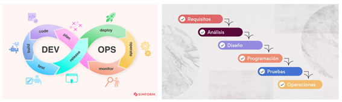

# Actividad 1 - CC3S2

---

**Autor:** Jhiens Angel Guerrero Ccompi  
**Fecha:** 01/09/2025  
**Tiempo invertido:** 06:00 horas  

---
## 4) Contenido  

### 4.1 DevOps vs. Cascada tradicional  

El modelo **Cascada (Waterfall)** tradicional se caracteriza por:  
- Ser **secuencial** o **lineal**.  
- Las fases del proyecto ya tienen un orden predefinido.  
- No se puede pasar a la siguiente fase hasta que la anterior fase esté completa.  

En cambio, **DevOps** se caracteriza por:  
- Ser **iterativo** y **continuo**.  
- Facilitar la **coordinación y colaboración** entre equipos.  
- Surgir como respuesta a las **deficiencias del modelo en cascada**.  

Imagen comparativa:  

---

### ¿Por qué DevOps acelera y reduce riesgo en software para la nube frente a cascada?

#### Feedback continuo  
- En **cascada**, los errores suelen descubrirse al final de todo el ciclo ,y corregir estos errores es costoso.  
- En **DevOps**, gracias a la integración continua (CI) y el monitoreo en la nube, cada cambio de código se prueba y se valida de inmediato.  
  
#### Pequeños lotes 
- En **cascada**, los lanzamientos son grandes, si algo falla, es difícil rastrear cuál de los muchos cambios es el culpable.  
- En **DevOps**, las entregas son frecuentes y ademas , hay pocos cambios.

#### Automatización  
- En **cascada**, despliegues, configuración de servidores y pruebas suelen ser manuales, lo que los hace lentos y propenso a errores humanos.  
- En **DevOps**,gracias a la nube. existen pipelines CI/CD e **“infraestructura como código”**,estos dos hacen todo de manera automatica,como el despliega, hacer pruebas y configurar.  

---

###  4.2 Ciclo tradicional de dos pasos y silos (limitaciones y anti-patrones)

El **ciclo tradicional de dos pasos**, también conocido como **“Construcción → Operación”**, consiste en un flujo lineal donde el software se desarrolla primero y luego se entrega a operaciones para su despliegue y mantenimiento.  
Este modelo, al trabajar sin integración continua, tiene algunas limitaciones.  

## Limitaciones del ciclo sin integración continua

1. **Grandes lotes**  
   - El software se acumula y se libera en bloques enormes.  
   - Esto retrasa la detección de errores y hace que cada liberación sea más riesgosa y compleja.  

2. **Colas de defectos**  
   - Los errores se descubren tarde, generalmente en producción.  
   - Esto genera una larga lista de incidencias que consume tiempo y recursos para resolver.
   - 
## Pregunta retadora: Anti-patrones y cómo agravan incidentes

### 1. “Throw over the wall”  
- Es un anti-patrón organizacional donde el equipo de desarrollo, una vez que terminen el software, lo *“lanzan” a operaciones* sin tener suficiente contexto ni colaboración.  
- **Cómo agrava incidentes:**  
  - Aumenta el **MTTR (Mean Time To Recovery)**, ya que operaciones desconoce los detalles del código y tarda más en resolver fallas.  
  - Genera **retrasos y retrabajos**, porque muchos problemas deben volver a desarrollo para ser corregidos.  
  - Puede causar **degradaciones repetitivas**, debido a soluciones rápidas sin atacar la raíz del problema.  

### 2. Seguridad como auditoría tardía  
- Es un anti-patrón en el ciclo de vida del software donde los **controles de seguridad se aplican únicamente al final**, cuando el producto ya está por salir a producción.  
- **Cómo agrava incidentes:**  
  - Aumenta la probabilidad de **vulnerabilidades críticas en producción**, ya que no se detectan a tiempo.  
  - Eleva el **costo y tiempo de recuperación**, pues los parches tardíos pueden romper funcionalidades estables.  
  - Provoca **incidentes recurrentes**, al no integrar seguridad desde el inicio del desarrollo.  

---

### 4.3 Principios y beneficios de DevOps (CI/CD, automatización, colaboración; Agile como precursor)

## CI/CD

En DevOps, **CI (Integración Continua)** se basa en integrar cambios pequeños y frecuentes, en lugar de acumular grandes bloques de código. Cada integración se valida con **pruebas automatizadas cercanas al código**, lo que permite detectar errores rápido y dar **retroalimentación continua** a los desarrolladores.  

Por otro lado, **CD (Entrega/Despliegue Continuo)** asegura que esos cambios puedan avanzar automáticamente hacia entornos de pruebas o producción siempre que superen los ciertos filtros. Esto genera **despliegues más predecibles, reversibles y con mejor colaboración entre desarrollo y operaciones**.  

## Agile como precursor

Prácticas de Agile que alimentan las decisiones del pipeline:  

- **Reuniones diarias (daily standups):** permiten identificar bloqueos y decidir qué cambios se promueven o se bloquean en el pipeline.  
- **Retrospectivas:** ayudan a ajustar reglas del pipeline, por ejemplo, añadir más pruebas automáticas si se detectan fallos recurrentes.  

## Indicador observable

Un indicador no financiero que mide la colaboración Dev-Ops es el **tiempo promedio desde que un Pull Request queda listo hasta que se despliega en un entorno de pruebas**.  

- **Cómo medirlo:** se compara el timestamp del merge con la hora de inicio del despliegue.  
- **Beneficio:** ofrece una visión clara de si el flujo se está volviendo más ágil, automatizado y colaborativo, sin necesidad de herramientas costosas.  

